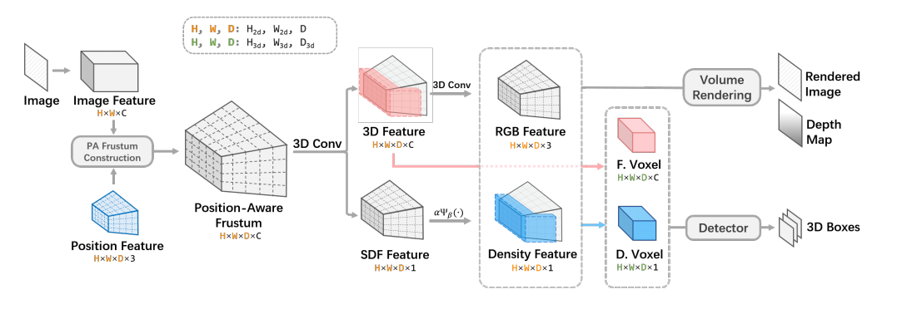

[](https://arxiv.org/abs/2308.09421)
# MonoNeRD: NeRF-like Representations for Monocular 3D Object Detection
## Introduction
This is the implementation of MonoNeRD: NeRF-like Representations for Monocular 3D Object Detection, In ICCV'23, Junkai Xu, Liang Peng, Haoran Cheng, Hao Li, Wei Qian, Ke Li, Wenxiao Wang and Deng Cai. Also a simple way to get 3D geometry and occupancy from monocular images. Paper is still under revision for camera-ready version.



## News
- [2023-8-21] [Paper](https://arxiv.org/abs/2308.09421) is released on arxiv!
- [2023-8-1] Code is released.
- [2023-7-14] MonoNeRD is accepted at ICCV 2023!! Code is comming soon.
- [2023-2-20] Demo release.
## Demo

### KITTI Demo


## Overview
- [Installation](#installation)
- [Getting Started](#getting-started)
- [Pretrained Models](#pretrained-models)
- [Citation](#citation)


## Installation

### Requirements
All the codes for training and evaluation are tested in the following environment:
* Linux (tested on Ubuntu 18.04)
* Python 3.8
* PyTorch 1.8.1
* Torchvision 0.9.1
* CUDA 11.1.1
* [`spconv 1.2.1 (commit f22dd9)`](https://github.com/traveller59/spconv)


### Installation Steps

a. Clone this repository.
```shell
git clone https://github.com/cskkxjk/MonoNeRD.git
```

b. Install the dependent libraries as follows:

* Install the dependent python libraries: 
```shell
pip install -r requirements.txt 
```


* Install the SparseConv library, we use the implementation from [`[spconv]`](https://github.com/traveller59/spconv). 

```shell
git clone https://github.com/traveller59/spconv
git reset --hard f22dd9
git submodule update --recursive
python setup.py bdist_wheel
pip install ./dist/spconv-1.2.1-cp38-cp38m-linux_x86_64.whl
```

* Install modified mmdetection from [`[mmdetection_kitti]`](https://github.com/xy-guo/mmdetection_kitti)
```shell
git clone https://github.com/xy-guo/mmdetection_kitti
python setup.py develop
```

c. Install this library by running the following command:
```shell
python setup.py develop
```

## Getting Started
### Dataset Preparation
For KITTI, dataset configs are located within [configs/stereo/dataset_configs](../configs/stereo/dataset_configs), 
and the model configs are located within [configs/stereo/kitti_models](../configs/stereo). 

For Waymo, dataset configs are located within [configs/mono/dataset_configs](../configs/mono/dataset_configs), 
and the model configs are located within [configs/mono/waymo_models](../configs/waymo).

* Please download the official [KITTI 3D object detection](http://www.cvlibs.net/datasets/kitti/eval_object.php?obj_benchmark=3d) dataset and organize the downloaded files as follows (the road planes are provided by OpenPCDet [[road plane]](https://drive.google.com/file/d/1d5mq0RXRnvHPVeKx6Q612z0YRO1t2wAp/view?usp=sharing), which are optional for training LiDAR models):
* Our implementation used a KITTI formated version of Waymo Open Dataset just like [`[CaDDN]`](https://github.com/TRAILab/CaDDN/issues/80), please refer to [`[Waymo-KITTI Converter]`](https://github.com/caizhongang/waymo_kitti_converter) for details.
```
MonoNeRD_PATH
├── data
│   ├── kitti
│   │   │── ImageSets
│   │   │── training
│   │   │   ├──calib & velodyne & label_2 & image_2 & image_3
│   │   │── testing
│   │   │   ├──calib & velodyne & image_2
│   ├── waymo
│   │   │── ImageSets
│   │   │── training
│   │   │   ├──calib & velodyne & label_2 & image_2 ...
│   │   │── validation
│   │   │   ├──calib & velodyne & label_2 & image_2 ...
├── configs
├── mononerd
├── tools
```

* You can also choose to link your KITTI and Waymo dataset path by
```
YOUR_KITTI_DATA_PATH=~/data/kitti_object
ln -s $YOUR_KITTI_DATA_PATH/ImageSets/ ./data/kitti/
ln -s $YOUR_KITTI_DATA_PATH/training/ ./data/kitti/
ln -s $YOUR_KITTI_DATA_PATH/testing/ ./data/kitti/

YOUR_WAYMO_DATA_PATH=~/data/waymo
ln -s YOUR_WAYMO_DATA_PATH/ImageSets/ ./data/waymo/
ln -s YOUR_WAYMO_DATA_PATH/training/ ./data/waymo/
ln -s YOUR_WAYMO_DATA_PATH/validation/ ./data/waymo/
```

* Generate the data infos by running the following command: 
```python 
python -m mononerd.datasets.kitti.lidar_kitti_dataset create_kitti_infos
python -m mononerd.datasets.kitti.lidar_kitti_dataset create_gt_database_only

python -m mononerd.datasets.waymo.lidar_waymo_dataset creat_waymo_infos
python -m mononerd.datasets.waymo.lidar_waymo_dataset create_gt_database_only
```

### Training & Testing
#### Train a model  

* Train with multiple GPUs
```
./scripts/dist_train.sh ${NUM_GPUS} 'exp_name' ./configs/stereo/kitti_models/mononerd.yaml
```

#### Test and evaluate the pretrained models

* To test with multiple GPUs:
```
./scripts/dist_test_ckpt.sh ${NUM_GPUS} ./configs/stereo/kitti_models/mononerd.yaml ./ckpt/pretrained_mononerd.pth
```

## Pretrained Models
### KITTI 3D Object Detection Baselines
The results are the BEV / 3D detection performance of Car class on the *val* set of KITTI dataset.
* All models are trained with 4 NVIDIA 3080Ti GPUs and are available for download.
* The training time is measured with 4 NVIDIA 3080Ti GPUs and PyTorch 1.8.1.

|| Training Time | Easy@R40 | Moderate@R40 | Hard@R40  | download |
|----------|--------:|:-------:|:-------:|:-------:|:---------:|
|mononerd|~13 hours| 29.03 / 20.64 | 22.03 / 15.44 | 19.41 / 13.99 | [Google-drive](https://drive.google.com/drive/folders/1ylbAVce09AjFq6J4SiFty2rTSvBbz7kM?usp=sharing) / [百度盘](https://pan.baidu.com/s/18gBBf6xrQIfRco3rbQ_bBw?pwd=8va7)|
## Citation

```
@inproceedings{xu2023mononerd,
      title={MonoNeRD: NeRF-like Representations for Monocular 3D Object Detection},
      author={Xu, Junkai and Peng, Liang and Cheng, Haoran and Li, Hao and Qian, Wei and Li, Ke and Wang, WenXiao and Cai, Deng},
      year={2023},
      booktitle={ICCV},
}
```

## Acknowledgements
This project benefits from the following codebases. Thanks for their great works! 
* [LIGA-Stereo](https://github.com/xy-guo/LIGA-Stereo) 
* [MINE](https://github.com/vincentfung13/MINE) 
* [volSDF](https://github.com/lioryariv/volsdf)
* [mipnerf_pl](https://github.com/hjxwhy/mipnerf_pl) 
* [MonoScene](https://github.com/astra-vision/MonoScene)
